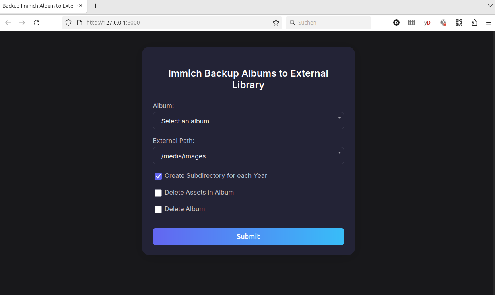

# immich-backup-albums-to-external-lib

## Introduction

[Immich](https://immich.app/) is a great open source self-hosted image and video management solution. Nevertheless, if you already have
an existing manually managed image/video archive, you might be reluctant to let immich organize the files on the file system according 
to immich-internal structures. This might also be an unwanted tool lock-in.

Fortunately, immich offers the integration of external libraries which are located in the file system. 

But if you use external libraries, you have to organize the images and videos manually by e.g. creating own folders for each year or event.

This repository contains a tool which allows to benefit from using the immich functionality of organizing images/videos in albums but still continue to
have the assets in an external library.

The proposed workflow is as follows:

* the immich mobile app is used to upload photos from the smartphone to the immich server
* in the immich app, you organize the photos by adding them to albums
* when an album is complete, you use the immich-backup-albums-to-external-lib tool to automatically copy the album to your external library folder
* optionally, the tool deletes the assets from immich's internal storage and database and deletes the album
* you can use [immich-folder-album-creator](https://github.com/Salvoxia/immich-folder-album-creator) to automatically re-create the album from the 
  external library

Since immich stores metadata like tags in its database, the metadata will be lost when moving the album to an external library. It is 
recommended to add the metadata only after the migration to the external library.

## Installation

The easiest way to install the tool is to use docker compose.

```
services:
  immich-backup-album-to-external-lib:
    container_name: immich_backup_album_to_external_lib
    image: ghcr.io/danielk990/immich-backup-album-to-external-lib:latest
    restart: unless-stopped
    volumes:
      - '/media/hd1/immich:/usr/src/app/upload:ro'
      - '/media/hd1:/media'
    env_file:
      - .backup-album-to-external-lib-env
    user: "1000:1000"
```

Adapt the following in the example above:

#### volumes

Make sure that the same volumes are mounted as for the immich container with the difference that external library 
path needs to be mounted writeable.

The first mount point is the path where immich stores uploaded files. This can be mounted read-only. 
The second mount point is the location of the external library. This needs to be writeable.

#### user

Change this to the user id which has access to the mounted paths. For the external library path, write access is required.

You can also remove the user option, then the container is executed with root rights.

#### env file

Create a file `.backup-album-to-external-lib-env` with the following content:

```
API_KEY=<your immich API key>
IMMICH_SERVER=<immich server URL with http/https prefix, e.g. http://immich.fritz.box>
IMMICH_PORT=<immich port, usually 2283>
EXTERNAL_LIB_PATHS=<comma-separated list of the paths of external libraries>
WEBUI_IP=<web UI IP, e.g. 127.0.0.1 for localhost or 0.0.0.0 for all interfaces>
WEBUI_PORT=<web UI port, e.g. 8000>

```

Example:

```
API_KEY=zDxV33G5eLRhIwDfJMlJOw25CQAMhzP7a7r5nHlux0
IMMICH_SERVER=http://immich.fritz.box
IMMICH_PORT=2283
EXTERNAL_LIB_PATHS=/media/Bilder/BilderGemeinsam,/media/Videos
WEBUI_IP=127.0.0.1
WEBUI_PORT=8000

```

#### Run Container

Finally, run the container with

```
docker compose up -d
```

To see if the tool has started, have a look in the docker logs:

```
docker compose logs
```

## Usage

The tool provides a web UI, open it in a webbrowser with the IP address you have configured via WEBUI_IP/WEBUI_PORT:



If the tool has access to the immich API, the list of albums is pre-filled with the existing album.

Select an album from the `Album` list you want to backup to your external library.

Then select the `External Path` to wich the album assets shall be copied.

By default, the tool creates a directory with the name of the album below `External Path`.

If you check the option `Create Subdirectory for each Year` the tool creates an additional sub-directory 
for each year. The year is read from the `startDate` attribute of the immich album data.

For example:

If the album is called "My Wedding", and the `Create Subdirectory for each Year` checkbox is checked,
the assets are copied to `/media/images/2020/My Wedding` (assuming `startDate`is 2020).

Finally, the tool can also delete the orignal immich-managed assets from immich if the copy was successful
if the checkbox `Delete Assets in Album` is checked. They are then moved to the trash.

The tool also deletes the album if the option `Delete Album` is checked.

To re-create the album from the external library automatically, I recommend to use
[immich-folder-album-creator](https://github.com/Salvoxia/immich-folder-album-creator)
which offers a lot of powerful options which it was not worth to re-implement them in this tool.

## Security Considerations

The tool is not intended to be used on a public webserver. 
It is recommended to use it only on localhost or a server which is not reachable from the Internet.
There are no security mechanims in place.